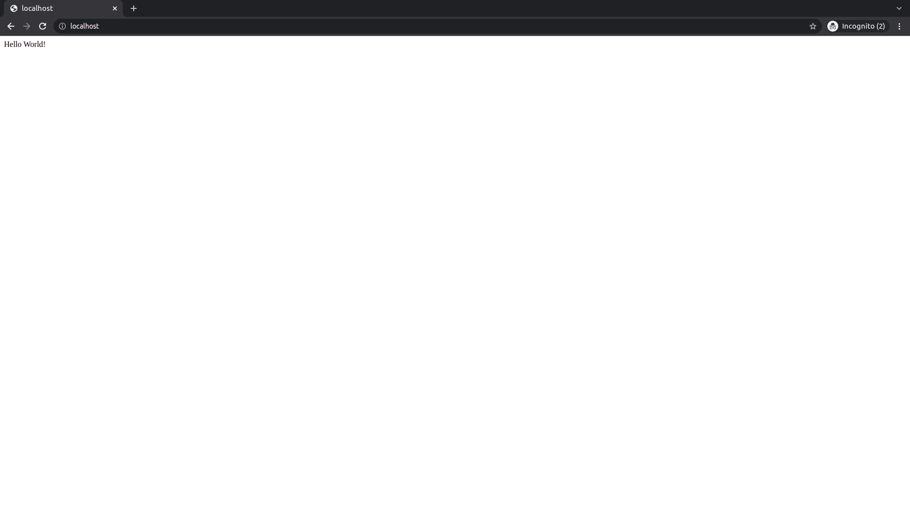
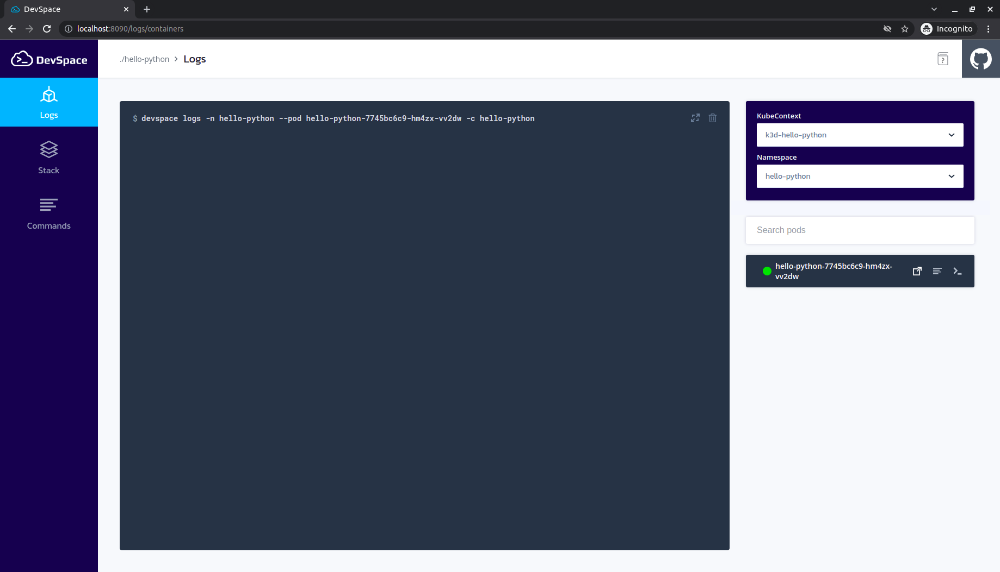

# 🐍 DevSpace Python

[](https://github.com/diegoluisi/hello-python/actions/workflows/python-app.yml)

DevSpace is an open-source developer tool for Kubernetes that lets you develop and deploy cloud-native software faster

### 💡 Why DevSpace
- Streamlined Workflow
- Faster Iterations
- Feature-Rich UI
### 🛠️ Requirements

|  Tools   | Version |
| :------: | :-----: |
| kubectl  | v1.22.3 |
| devspace | 5.18.4  |
|   k3d    | v5.3.0  |

### [kubectl](https://kubernetes.io/)

- [Install kubectl on Linux](https://kubernetes.io/docs/tasks/tools/install-kubectl-linux/)
- [Install kubectl on macOS](https://kubernetes.io/docs/tasks/tools/install-kubectl-macos)
- [Install kubectl on Windows](https://kubernetes.io/docs/tasks/tools/install-kubectl-windows)

### [DevSpace](https://devspace.sh/)

- [Install DevSpace](https://devspace.sh/cli/docs/getting-started/installation)

### [k3d](https://k3d.io/)

```bash
curl -s https://raw.githubusercontent.com/k3d-io/k3d/main/install.sh | bash
```

### Create Cluster and NameSpace

```bash
k3d cluster create --config k3d.yaml
kubectl create namespace hello-python
```

### Configure DevSpace

```bash
devspace use namespace hello-python
```

### Start Development

```bash
devspace dev

  ____              ____
  |  _ \  _____   __/ ___| _ __   __ _  ___ ___
  | | | |/ _ \ \ / /\___ \| '_ \ / _` |/ __/ _ \
  | |_| |  __/\ V /  ___) | |_) | (_| | (_|  __/
  |____/ \___| \_/  |____/| .__/ \__,_|\___\___|
                          |_|

Welcome to your development container!

This is how you can work with it:
- Run `python main.py` to build the application
- Files will be synchronized between your local machine and this container
- Some ports will be forwarded, so you can access this container on your local machine via http://localhost

```

### After the container start please run 

```bash 
python main.py
```
### 

```bash
curl http://localhost/
Hello World!
```


### [DevSpace UI](http://localhost:8090)



### ♻️ Purge
```bash
devspace purge
```